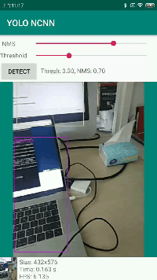

# real time ncnn android yolo5 detect
实时人、物品检测

## 部署及打包apk

不需要下载ncnn已经包在里面了，直接clone然后AS build就能玩~

如果你还没入门请到我的另一个[仓库](https://github.com/binzhouchn/ncnn-android-yolov5)查看具体步骤

`Gradle model version=5.4.1, NDK version=22.0.7026061`

## 程序闪退请到应用权限管理设置，开启摄像头和录音权限

## 实时检测示例

