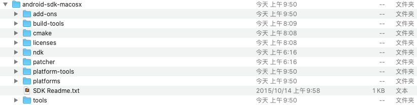
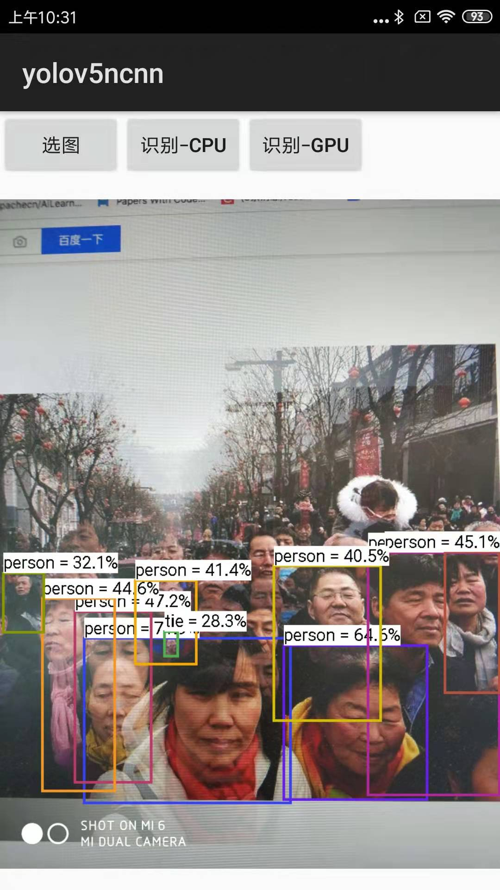

# ncnn-android-yolov5

this is a sample ncnn android project, it depends on ncnn library only 
The YOLOv5 object detection 
选取静态图像识别(以mac为例)

原项目参考: 
https://github.com/nihui/ncnn-android-yolov5

原项目介绍比较精炼，这个项目梳理了下从安装android studio到打包apk文件安装全流程详细讲解，包括遇到的坑 

## build&run全流程

### 第一步

git clone git@github.com:binzhouchn/ncnn-android-yolov5.git

### 第二步

https://github.com/Tencent/ncnn/releases 
下载[ncnn-20201218-android-vulkan.zip](https://github.91chifun.workers.dev/https://github.com//Tencent/ncnn/releases/download/20201218/ncnn-20201218-android-vulkan.zip) 
解压到项目app/src/main/jni文件夹下 或者 change the ncnn_DIR path to yours in app/src/main/jni/CMakeLists.txt

### 第三步

 - 安装jdk这个就不展开了，我用的是jdk1.8.0_231 
 - 下载[Android Studio 4.1.3](https://developer.android.google.cn/studio/) 
 - 去[AndroidDevTools网站](https://www.androiddevtools.cn/)下载[android-sdk_r24.4.macosx.zip](https://dl.google.com/android/android-sdk_r24.4.1-macosx.zip?utm_source=androiddevtools&utm_medium=website) 
 - 解压android-sdk_r24.4.macosx.zip得到android-sdk-macosx，我放到了/Users/zhoubin/下
 - 下载[platform-tools](http://pan.baidu.com/s/1dDu6xC9?utm_source=androiddevtools&utm_medium=website)解压放到android-sdk-macosx下
 - 下载[Build-Tools](http://pan.baidu.com/s/1i367FTz?utm_source=androiddevtools&utm_medium=website)解压放到android-sdk-macosx/build-tools下
 - 下载[android 5.0](http://pan.baidu.com/s/1o6v7E2I?utm_source=androiddevtools&utm_medium=website)解压放到android-sdk-macosx/platforms下
 - bashrc中配置路径export ANDROID_HOME=/Users/zhoubin/android-sdk-macosx;export PATH=$PATH:$ANDROID_HOME/tools:$ANDROID_HOME/platform-tools
 - 下载[gradle-5.4.1-all.zip](https://download.csdn.net/download/quantbaby/16073855)，tar -xvf grad541A.tar以后，放到/Users/zhoubin/.gradle/wrapper/dists/gradle-5.4.1-all/3221gyojl5jsh0helicew7rwx文件夹下，不需要解压
 - 打开android studio，这时还会下载一些依赖包，有一些依赖jar包需要翻墙比如kotlin-reflect-1.3.41.jar包，可以直接百度搜索（如果搜不到可以私信我要），下载好后放到/Users/zhoubin/.gradle/wrapper/dists/gradle-5.4.1-all/3221gyojl5jsh0helicew7rwx/gradle-5.4.1/lib文件夹下，然后点同步继续
 - 最后如果没有安装ndk和cmake也会编译失败，需要Preferences/Appearance&Behavior/System Settings/Android SDK点SDK Tools然后点NDK(Side by side)和CMake然后Apply即可（以下有截图展示，可以选择对应NDK版本我装了21.0.6和22.0.7）
 - 全部同步完后就能看到build success!

ndk和cmake安装截图 

`Gradle model version=5.4.1, NDK version=22.0.7026061`

android-sdk-macosx文件结构 

### 第四步

打包sdk(有密匙) 

 - AS（Android Studio 简称）的【Build】下，点击【Generate Signed Bundle / APK…】
 - 勾选【APK】，再点击【Next】
 - 弹窗内如下图所示是一片空白，那么就是没有密匙，需要自己创建一个
 - 点击【Create new…】开始创建密匙。

 - 选择key保存路径，任选一个文件夹，整体输入完信息后，点击【OK】进行保存；（最后弹出的错误警告可忽略）
 - 选择release，然后勾选<V2 (Full APK Signature)>，点击【Finish】开始编译生成APK文件(在app/release/下会生成一个apk文件)
 - 直接在安卓机上安装apk文件即可，cheers!

[Android Studio4.1.2进行APK打包的两种方式详解](https://blog.csdn.net/ssj925319/article/details/114547082) 

## screenshot

